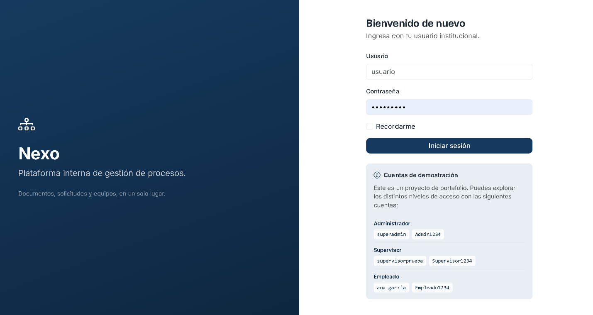
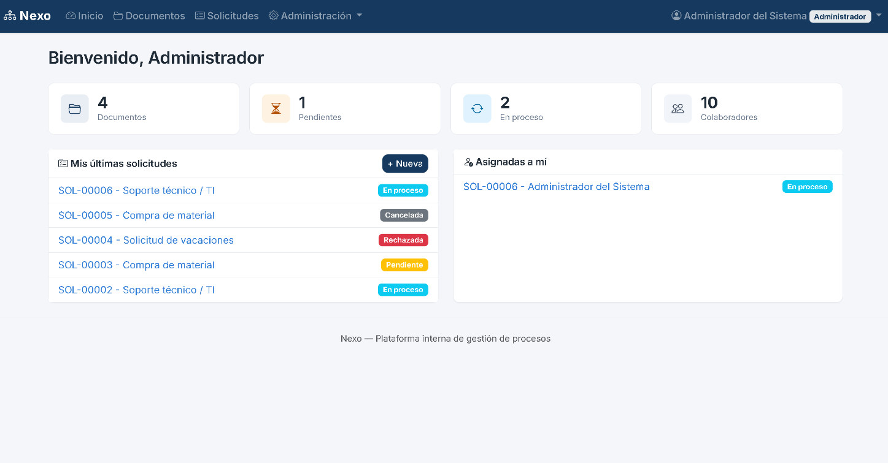
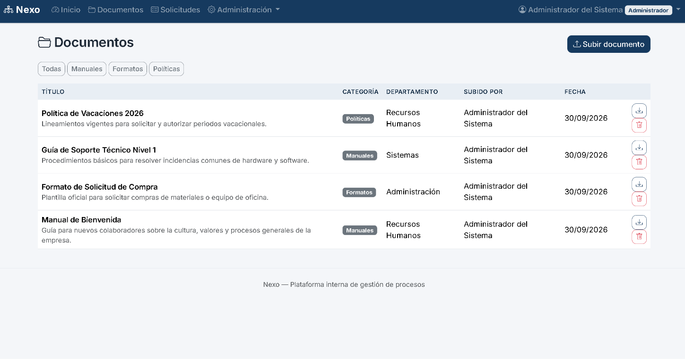
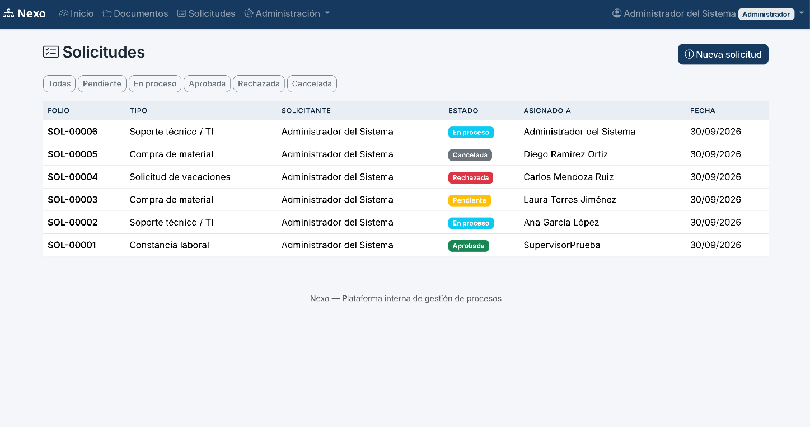
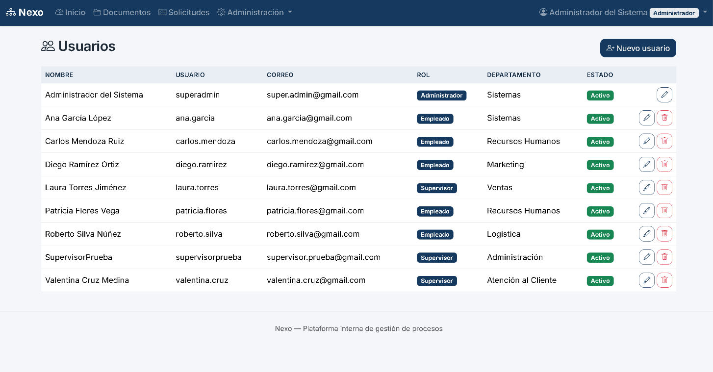
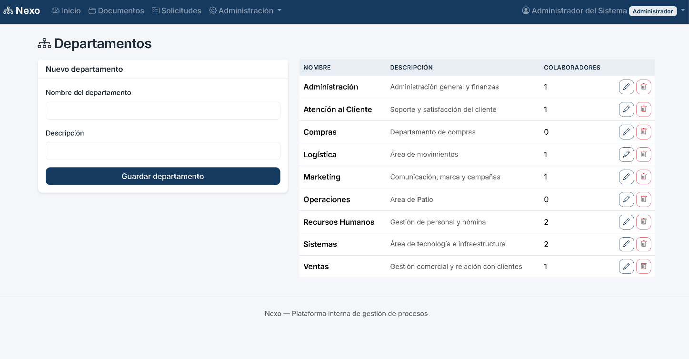
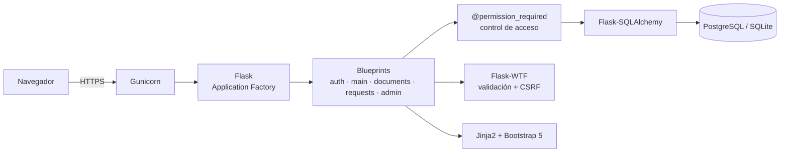
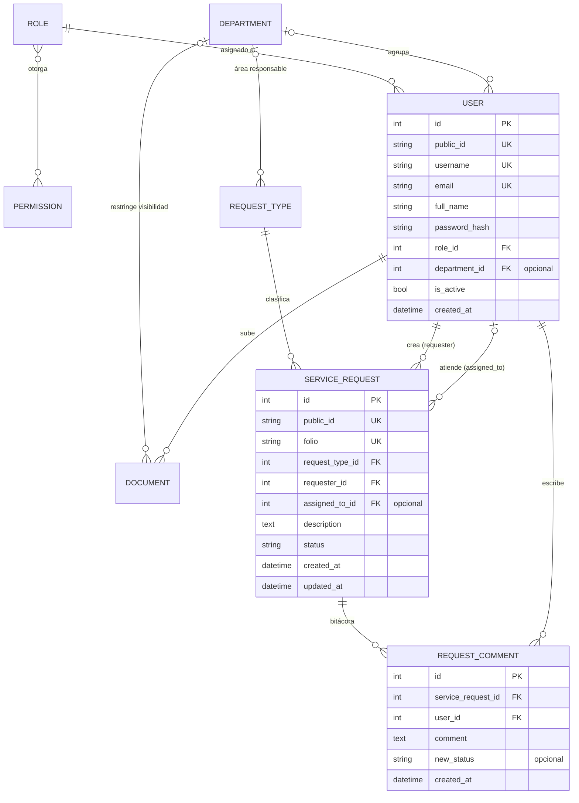
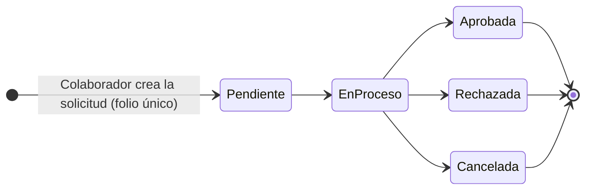

# Nexo — Intranet Corporativa


Plataforma web para digitalizar procesos internos de una empresa: gestión documental, solicitudes con flujo de aprobación y seguimiento, y administración de usuarios con perfiles y permisos. Desarrollada con Python y Flask, con especial atención al control de acceso, la seguridad de la aplicación y el diseño responsivo.

**🔗 Demo en vivo:** [Nexo-Intranet](https://nexo-intranet.onrender.com)

> **Acceso de prueba para revisión:**
>
> | Rol | Usuario | Contraseña |
> |---|---|---|
> | Administrador | `superadmin` | `Admin1234` |
> | Supervisor | `supervisorprueba` | `Supervisor1234` |
> | Empleado | `ana.garcia` | `Empleado1234` |
>
> *Nota: el servicio gratuito de Render puede tardar ~30-60 s en responder la primera vez (arranque en frío). Los datos de la demo son ficticios; no subas información real.*

> Proyecto personal construido para practicar arquitectura de aplicaciones web, autenticación y autorización basada en roles, modelado de bases de datos relacionales y despliegue en producción.

---

## Tabla de contenido

- [Capturas de pantalla](#capturas-de-pantalla)
- [Funcionalidades](#funcionalidades)
- [Stack tecnológico](#stack-tecnológico)
- [Arquitectura](#arquitectura)
- [Decisiones técnicas](#decisiones-técnicas)
- [Modelo de datos](#modelo-de-datos)
- [Flujo de una solicitud](#flujo-de-una-solicitud)
- [Roles y permisos](#roles-y-permisos)
- [Instalación local](#instalación-local)
- [Variables de entorno](#variables-de-entorno)
- [Datos de ejemplo](#datos-de-ejemplo)
- [Despliegue en producción](#despliegue-en-producción)
- [Seguridad](#seguridad)
- [Limitaciones conocidas](#limitaciones-conocidas)
- [Roadmap](#roadmap)
- [Autor](#autor)

---

## Capturas de pantalla

### Inicio de sesión

<p align="center">
  
</p>

### Inicio (dashboard)

<p align="center">
  
</p>

### Documentos

<p align="center">
  
</p>

### Solicitudes

<p align="center">
  
</p>

### Usuarios

<p align="center">
  
</p>

### Departamentos

<p align="center">
  
</p>

## Funcionalidades

- **Autenticación y perfiles**: acceso por usuario/contraseña con contraseñas almacenadas como hash, roles (Administrador, Supervisor, Empleado) y permisos granulares por funcionalidad.
- **Gestión documental**: subir, categorizar, filtrar y descargar documentos. Un documento puede ser público o restringido: los no públicos solo los ven los usuarios de su mismo departamento y quienes tienen el permiso `manage_documents`. Solo este último permiso permite eliminar documentos.
- **Solicitudes internas**: los colaboradores generan solicitudes con folio único; los responsables las asignan, actualizan su estado (Pendiente → En proceso → Aprobada/Rechazada/Cancelada) y dejan registro en una bitácora de seguimiento.
- **Panel de administración**: alta, edición y baja de usuarios, gestión de departamentos y consulta de roles/permisos. Eliminar un usuario borra sus documentos (incluido el archivo físico), sus comentarios y las solicitudes que creó con su bitácora; las solicitudes que tenía asignadas no se borran, quedan sin responsable.
- **Protección del último administrador**: el sistema impide eliminar, degradar o desactivar al último administrador activo.
- **Validación exhaustiva**: todos los formularios validan longitud, formato y campos obligatorios, mostrando errores específicos por campo.
- **Identificadores no secuenciales**: las URLs usan identificadores públicos (UUID) en lugar de IDs autoincrementales, evitando exponer el volumen de registros del sistema.
- **Interfaz responsiva** con una identidad visual corporativa propia (Bootstrap 5 + tipografía Inter).

## Stack tecnológico

| Capa | Tecnología |
|---|---|
| Backend | Python 3.11+, Flask, Flask-SQLAlchemy, Flask-Login, Flask-WTF |
| Base de datos | SQLite (desarrollo) / PostgreSQL (producción) |
| Frontend | HTML5, CSS3, JavaScript, Jinja2, Bootstrap 5 |
| Servidor de producción | Gunicorn |
| Autenticación | Hash de contraseñas (Werkzeug, `scrypt` por defecto), sesiones con Flask-Login |
| Control de versiones | Git / GitHub |
| Hosting | Render (Web Service + PostgreSQL administrado) |

## Arquitectura



El proyecto sigue el patrón **Application Factory** de Flask junto con **Blueprints**, separando cada módulo funcional en su propio archivo:

```
nexo_intranet/
├── app/
│   ├── __init__.py          # Application factory, extensiones, manejo de errores
│   ├── models.py            # Modelos ORM (usuarios, roles, permisos, documentos, solicitudes)
│   ├── forms.py             # Formularios con validación (Flask-WTF)
│   ├── decorators.py        # Control de acceso por permisos
│   ├── seed.py              # Datos base: roles, permisos, departamentos, tipos de solicitud, admin inicial
│   ├── routes/
│   │   ├── auth.py          # Login, logout, cambio de contraseña
│   │   ├── main.py          # Dashboard
│   │   ├── documents.py     # Gestión documental
│   │   ├── requests.py      # Solicitudes: crear, listar, actualizar, eliminar
│   │   └── admin.py         # Usuarios, roles, departamentos
│   ├── templates/           # Vistas Jinja2 (HTML + Bootstrap 5)
│   └── static/              # CSS y JS
├── instance/                # Generada en ejecución, fuera de Git: SQLite local y documentos subidos (instance/uploads)
├── docs/images/             # Capturas de pantalla del README
├── config.py                # Configuración por entorno (desarrollo / producción)
├── run.py                   # Entrada para desarrollo local
├── wsgi.py                  # Entrada para servidores WSGI en producción
├── Procfile                 # Definición de proceso para plataformas cloud
├── runtime.txt              # Versión de Python para el despliegue
├── .env.example             # Plantilla de variables de entorno
└── requirements.txt
```

## Decisiones técnicas

| Decisión | Motivo |
|---|---|
| **Application Factory + Blueprints** | Permite crear la app con distinta configuración (desarrollo, producción, pruebas) y mantener cada módulo aislado y fácil de ubicar. |
| **Permisos en lugar de roles en las rutas** | Cada ruta exige un permiso (`@permission_required`), no un nombre de rol. Se pueden crear roles o ajustar permisos sin tocar las vistas. |
| **UUID como identificador público** | Evita exponer el volumen de registros y los *IDOR* por enumeración de IDs; el `id` autoincremental queda solo como clave interna. |
| **Configuración estricta en producción** | `config.py` valida al arrancar que existan `SECRET_KEY` y `DATABASE_URL`; si falta alguna, la aplicación no inicia en lugar de usar valores por defecto inseguros. |
| **Inicialización de BD al arrancar (`wsgi.py`)** | Los planes gratuitos de Render no dan acceso a Shell; así el despliegue deja la base lista sin pasos manuales. La inicialización es idempotente. |
| **Administrador inicial condicionado** | El usuario `admin` solo se crea si no existe ningún administrador, y en producción su contraseña sale de una variable de entorno, no del código. |
| **Documentos fuera de `static`** | Los archivos se guardan en `instance/uploads` y solo se sirven mediante una vista que verifica visibilidad y departamento. |
| **SQLite en desarrollo, PostgreSQL en producción** | Arranque local sin instalar nada y un motor robusto en producción, apoyado en el ORM para ser agnóstico. |
| **Eliminación en cascada explícita** | Borrar un usuario elimina sus documentos y solicitudes de forma controlada, evitando registros huérfanos. |
| **Validación con Flask-WTF** | Validación y protección CSRF centralizadas en una sola capa para todos los formularios. |

## Modelo de datos



| Entidad | Descripción |
|---|---|
| `User` | Colaborador: usuario, correo, nombre completo, contraseña (hash), rol, departamento opcional, estado activo/inactivo y fecha de alta |
| `Role` / `Permission` | Perfiles y permisos del sistema (relación N:M mediante `role_permissions`) |
| `Department` | Áreas de la empresa; agrupan usuarios, restringen documentos y pueden ser responsables de tipos de solicitud |
| `Document` | Documento con título, descripción, categoría, archivo original/almacenado, visibilidad pública o restringida, departamento asociado opcional, autor y fecha de carga |
| `RequestType` | Catálogo de tipos de solicitud, con departamento responsable opcional |
| `ServiceRequest` | Solicitud con folio único, tipo, solicitante, responsable asignado (opcional), descripción, estado y fechas de creación/actualización |
| `RequestComment` | Entrada de la bitácora: autor, comentario, nuevo estado (si hubo cambio) y fecha. Se elimina en cascada junto con su solicitud |

Las entidades `User`, `Document`, `ServiceRequest` y `Department` usan un `public_id` (UUID) como identificador expuesto en la interfaz y en las URLs, manteniendo el `id` autoincremental solo como clave interna de base de datos.

## Flujo de una solicitud



El diagrama muestra el flujo previsto. Las transiciones no están restringidas por la aplicación: quien tiene el permiso `manage_requests` puede asignar un responsable y cambiar el estado de forma manual.

Cada actualización (cambio de estado o reasignación) deja un comentario en la bitácora (`RequestComment`), de modo que siempre se sabe quién hizo qué y cuándo.

## Roles y permisos

| Permiso | Descripción | Administrador | Supervisor | Empleado |
|---|---|:-:|:-:|:-:|
| `manage_users` | Crear, editar y eliminar usuarios | ✅ | | |
| `manage_roles` | Administrar roles, permisos y departamentos | ✅ | | |
| `manage_documents` | Administrar todos los documentos (ver, eliminar) | ✅ | | |
| `upload_documents` | Subir documentos a la intranet | ✅ | ✅ | ✅ |
| `manage_requests` | Gestionar y dar seguimiento a solicitudes de otros | ✅ | ✅ | |
| `delete_requests` | Eliminar solicitudes de forma permanente | ✅ | | |

Cualquier usuario autenticado puede crear solicitudes y consultar las propias.

Los permisos se verifican con el decorador `@permission_required` en cada ruta, no por el nombre del rol. La asignación de permisos a cada rol se define en `seed.py` y se sincroniza en cada arranque de la aplicación, por lo que un cambio hecho directamente en la base de datos se sobrescribe en el siguiente reinicio.

## Instalación local

### Requisitos

- Python 3.11+
- Git

### Pasos

```bash
git clone https://github.com/AaronChavezMtz/nexo-intranet.git
cd nexo-intranet

python -m venv venv
source venv/bin/activate        # Windows: venv\Scripts\activate

pip install -r requirements.txt

cp .env.example .env            # define SECRET_KEY

flask --app run.py seed-db      # crea tablas, roles, permisos, departamentos y usuario admin
python run.py
```

La aplicación queda disponible en `http://localhost:5000`.

**Usuario administrador inicial**: `seed-db` crea el usuario `admin` solo si todavía no existe ningún usuario con rol Administrador. En desarrollo, la contraseña por defecto es `Admin123!` (solo para entorno local).

> Cambia esta contraseña inmediatamente después del primer inicio de sesión, desde `Mi cuenta → Cambiar contraseña`.

## Variables de entorno

| Variable | Requerida | Descripción |
|---|---|---|
| `FLASK_ENV` | Sí | `development` o `production` |
| `SECRET_KEY` | Sí en producción | Clave para firmar sesiones y formularios. Generar con `python -c "import secrets; print(secrets.token_hex(32))"` |
| `DATABASE_URL` | Sí en producción | Cadena de conexión a PostgreSQL. En desarrollo se usa SQLite si no se define |
| `ADMIN_INITIAL_PASSWORD` | Solo en producción, si aún no existe ningún administrador | Contraseña del administrador inicial. Sin ella, en producción no se crea ningún usuario inicial |

En producción, la aplicación no arranca si falta `SECRET_KEY` o `DATABASE_URL`.

## Datos de ejemplo

`seed-db` (y el arranque de `wsgi.py`) crean, de forma idempotente, los siguientes datos base:

- **Roles:** Administrador, Supervisor y Empleado, con los permisos descritos arriba.
- **Departamentos:** Sistemas, Recursos Humanos y Administración.
- **Tipos de solicitud:**

| Tipo | Departamento |
|---|---|
| Solicitud de vacaciones | Recursos Humanos |
| Soporte técnico / TI | Sistemas |
| Compra de material | Administración |
| Constancia laboral | Recursos Humanos |

- **Usuario `admin`:** solo si no existe ningún administrador (ver [Instalación local](#instalación-local) y [Variables de entorno](#variables-de-entorno)).

## Despliegue en producción

El proyecto está preparado para desplegarse en **Render** (o cualquier plataforma compatible con Gunicorn + PostgreSQL):

1. Crear una base de datos **PostgreSQL** administrada y copiar su `DATABASE_URL`.
2. Crear un **Web Service** conectado al repositorio de GitHub.
3. Definir las variables `FLASK_ENV=production`, `SECRET_KEY` y `DATABASE_URL`. En el primer despliegue, definir también `ADMIN_INITIAL_PASSWORD` para crear el administrador inicial.

Detalles de la configuración:

- `wsgi.py` expone la aplicación para el servidor WSGI y ejecuta automáticamente la inicialización de la base de datos al arrancar (sin necesidad de acceso a Shell, compatible con planes gratuitos).
- `Procfile` define el comando de arranque con Gunicorn y `runtime.txt` fija la versión de Python.
- `config.py` separa la configuración de desarrollo y producción, y en producción exige `SECRET_KEY` y `DATABASE_URL` explícitos en lugar de valores por defecto.

## Seguridad

- Contraseñas almacenadas como hash con Werkzeug (`scrypt` por defecto), nunca en texto plano.
- Protección CSRF en todos los formularios (Flask-WTF).
- Control de acceso mediante decoradores de permisos (`@permission_required`) y comprobaciones de propiedad o departamento en las vistas que muestran datos individuales (solicitudes y descargas de documentos).
- Cookies de sesión `HttpOnly`, `SameSite=Lax`, y `Secure` en producción.
- Identificadores públicos (UUID) en URLs en lugar de IDs autoincrementales.
- Subida de archivos con validación de extensión y tamaño máximo (15 MB), nombres de almacenamiento aleatorios y descarga únicamente a través de una vista que verifica la visibilidad del documento. Los archivos no se sirven desde `static`.
- Sin credenciales fijas en producción: el administrador inicial solo se crea si no hay ninguno, y su contraseña proviene de una variable de entorno.
- El sistema impide eliminar, degradar o desactivar al último administrador activo.
- Eliminación en cascada controlada: borrar un usuario elimina de forma explícita sus documentos, comentarios y solicitudes creadas, evitando registros huérfanos.
- Confirmación explícita (modal) antes de cualquier acción destructiva.

## Limitaciones conocidas

- **Archivos subidos en disco local** (`instance/uploads`): en plataformas con sistema de archivos efímero, como el plan gratuito de Render, los documentos se pierden al reiniciar o volver a desplegar. Para producción real se recomienda almacenamiento externo (S3, Cloudinary o un disco persistente).
- **Sin migraciones de esquema**: salvo la incorporación de `public_id`, que `seed.py` aplica de forma automática, los cambios en los modelos requieren recrear o ajustar la base manualmente hasta incorporar Flask-Migrate.
- **Folios**: se generan como el siguiente al mayor existente y, ante una colisión por creaciones simultáneas, se reintenta. Una secuencia de base de datos sería más robusta.
- **Sin pruebas automatizadas** por ahora (ver roadmap).

## Roadmap

- [ ] Almacenamiento externo de documentos (S3 / Cloudinary)
- [ ] Notificaciones por correo al cambiar el estado de una solicitud
- [ ] Exportación de reportes (PDF/Excel) de solicitudes por periodo
- [ ] Migraciones de esquema con Flask-Migrate/Alembic
- [ ] Pruebas automatizadas con pytest
- [ ] API REST para integración con otras herramientas internas
- [ ] Panel de administración de roles y permisos vía interfaz (actualmente en `seed.py`)

## Autor

**Aarón Yosef Chávez Martínez** · [GitHub](https://github.com/AaronChavezMtz) · [LinkedIn](https://www.linkedin.com/in/aaron-chavez-99bbb8393)

## Licenci

Distribuido bajo la licencia MIT — ver [LICENSE](LICENSE).